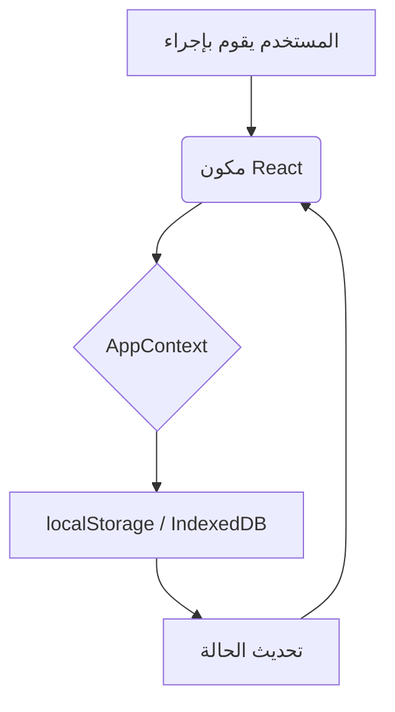
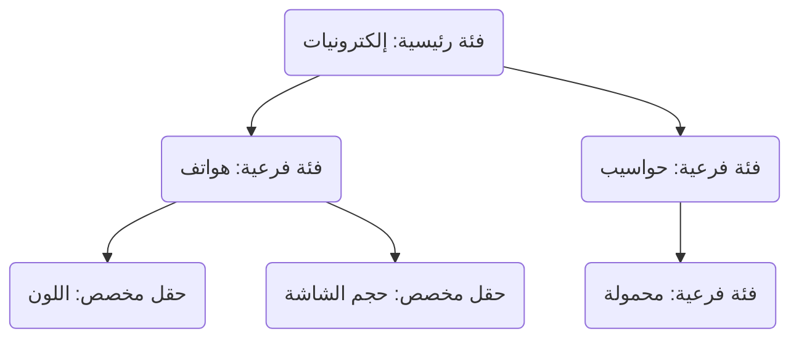

# 
<div align="center">
  
  <h1 style="font-size: 2.5em;">نظام الصدارة لإدارة المنتجات</h1>
  <p><strong>توثيق شامل لإصدار React v1.0</strong></p>
</div>

---

## 1️⃣ نظرة عامة على النظام

### وصف النظام والغرض منه
نظام "الصدارة" هو تطبيق ويب متقدم لإدارة المنتجات والمخزون، مبني باستخدام React.js. تم تصميمه خصيصًا ليناسب احتياجات السوق العربي، مع دعم كامل للغة العربية والاتجاه من اليمين لليسار (RTL). يعمل النظام كتطبيق أحادي الصفحة (SPA)، مما يوفر تجربة استخدام سريعة وسلسة تشبه تطبيقات سطح المكتب.

### أهداف النظام والفئة المستهدفة
- **الهدف الرئيسي**: توفير أداة سهلة وقوية لأصحاب المتاجر الصغيرة والمتوسطة لإدارة منتجاتهم ومخزونهم بكفاءة دون الحاجة لأنظمة معقدة ومكلفة.
- **الفئة المستهدفة**: أصحاب المتاجر، مديري المخزون، البائعين عبر الإنترنت، وأي شخص يحتاج لتصنيف وتتبع المنتجات.

### مميزاته الأساسية
- **إدارة متكاملة للمنتجات**: إضافة، تعديل، حذف، وعرض المنتجات مع صورها وتفاصيلها.
- **نظام فئات هرمي**: إنشاء فئات رئيسية وفرعية بمستويات غير محدودة.
- **حقول مخصصة ديناميكية**: تحديد حقول بيانات فريدة لكل فئة منتج (مثل الحجم، اللون، المادة).
- **واجهة متجاوبة بالكامل**: تجربة استخدام مثالية على الحواسيب، الأجهزة اللوحية، والهواتف.
- **دعم الوضع الداكن**: إمكانية التبديل بين الوضع الفاتح والداكن لراحة العين.
- **تخصيص كامل**: التحكم في ألوان الواجهة، العملة، ونظام التقويم (ميلادي/هجري).
- **يعمل دون اتصال**: جميع البيانات تُخزن محليًا في المتصفح، مما يضمن استمرارية العمل حتى مع انقطاع الإنترنت.
- **إدارة البيانات**: نظام سهل للنسخ الاحتياطي والاستيراد.

---

## 2️⃣ الهيكل التنظيمي للنظام

يتبع المشروع هيكلًا معياريًا لتسهيل الصيانة والتطوير.

### هيكل الملفات والمجلدات
```
/
├── public/
│   └── ... (ملفات عامة)
├── src/
│   ├── components/  (مكونات React القابلة لإعادة الاستخدام)
│   │   ├── Dashboard.tsx
│   │   ├── Products.tsx
│   │   ├── Categories.tsx
│   │   ├── Settings.tsx
│   │   ├── Sidebar.tsx
│   │   ├── Header.tsx
│   │   └── Modal.tsx
│   ├── context/     (لإدارة الحالة العامة للتطبيق)
│   │   └── AppContext.tsx
│   ├── hooks/       (خطافات React المخصصة)
│   │   └── useLocalStorage.ts
│   ├── utils/       (وظائف مساعدة)
│   │   ├── helpers.ts
│   │   └── dateUtils.ts
│   ├── types.ts     (تعريفات TypeScript للبيانات)
│   ├── constants.ts (ثوابت التطبيق)
│   ├── App.tsx      (المكون الرئيسي للتطبيق)
└── └── index.tsx    (نقطة دخول التطبيق)
```

### ترتيب الصفحات والربط بالهيكل العام
يتم التحكم في عرض الصفحات عبر مكون `App.tsx` الذي يعمل كـ "Master Layout". هو يحتوي على:
- **`Sidebar.tsx`**: الشريط الجانبي للتنقل (ثابت على الشاشات الكبيرة، ومنبثق على الصغيرة).
- **`Header.tsx`**: رأس الصفحة (يظهر على الشاشات الصغيرة ويحتوي على زر القائمة).
- **منطقة المحتوى**: يتم فيها عرض الصفحة النشطة حاليًا (`Dashboard`, `Products`, `Categories`, `Settings`).

يتم تمرير الصفحة النشطة وتغييرها باستخدام React State، مما يضمن تحديث الواجهة بسلاسة دون إعادة تحميل.

---

## 3️⃣ التقنيات المستخدمة

| المكون | التقنية | الوصف |
|---|---|---|
| **الواجهة الأمامية** | React.js, TypeScript | لبناء واجهة مستخدم تفاعلية وقوية مع ضمان سلامة الأنواع. |
| **التصميم** | Tailwind CSS | إطار عمل CSS يعتمد على "Utility-first" لبناء تصميمات مخصصة وسريعة. |
| **مكونات الواجهة** | Bootstrap 5 (JS) | للاستفادة من المكونات التفاعلية الجاهزة مثل النوافذ المنبثقة (Modals). |
| **الأيقونات** | Bootstrap Icons | مكتبة أيقونات شاملة ومتناسقة. |
| **إدارة الحالة** | React Context API | لإدارة ومشاركة الحالة العامة بين جميع مكونات التطبيق. |
| **التخزين المحلي** | `localStorage` & `IndexedDB` | لتخزين البيانات في متصفح المستخدم وضمان العمل دون اتصال. |

### معمارية تخزين البيانات
يستخدم النظام استراتيجية تخزين محلية مزدوجة لتحقيق أفضل أداء:
1.  **`localStorage`**: يُستخدم لتخزين البيانات البسيطة نسبيًا مثل (المنتجات، الإعدادات). يتميز بسهولة الاستخدام ولكنه متزامن (Synchronous) وقد يصبح بطيئًا مع كميات البيانات الضخمة.
2.  **`IndexedDB` (عبر Dexie.js)**: يُستخدم لصفحة "الفئات" نظرًا لتعقيد بياناتها (هيكل شجري، حقول مخصصة، علاقات). يتميز بأنه غير متزامن (Asynchronous)، يدعم المعاملات (Transactions)، ومُحسَّن للتعامل مع كميات كبيرة من البيانات المعقدة بكفاءة عالية.

### الربط المستقبلي مع قاعدة بيانات خارجية
تم تصميم `AppContext.tsx` ليكون نقطة مركزية لجميع عمليات البيانات. لربط النظام بقاعدة بيانات خارجية (مثل PostgreSQL عبر REST API)، يمكن تعديل الوظائف داخل هذا الملف (مثل `addProduct`, `updateCategory`) لتنفيذ طلبات `fetch` إلى الخادم بدلاً من التعديل المباشر على التخزين المحلي.

**استراتيجية المزامنة المقترحة:**
- **الكتابة (Updates)**: عند إجراء أي تعديل، يتم إرساله أولاً إلى الخادم. إذا نجح الطلب، يتم تحديث الحالة المحلية. إذا فشل (بسبب انقطاع الإنترنت)، يتم تخزين التعديل في قائمة انتظار محلية (Queue) وإعادة محاولة إرساله عند عودة الاتصال.
- **القراءة (Reads)**: يتم جلب البيانات من الخادم عند بدء تشغيل التطبيق وتخزينها محليًا (Caching). يتم استخدام البيانات المحلية للعرض الفوري، مع تحديثها في الخلفية عند توفر بيانات أحدث من الخادم.

---

## 4️⃣ طريقة تشغيل النظام

هذا المشروع مهيأ للعمل في بيئات تطوير React القياسية أو بيئات العرض المباشر.

### المتطلبات
- متصفح ويب حديث (Chrome, Firefox, Edge).
- لتشغيل المشروع محليًا للتطوير: Node.js (v16 أو أحدث).

### خطوات التشغيل للتطوير
1.  **تنزيل المشروع**: `git clone <repository-url>`
2.  **تثبيت الاعتماديات**: `npm install`
3.  **تشغيل خادم التطوير**: `npm start`
4.  **فتح التطبيق**: افتح المتصفح على العنوان `http://localhost:3000`.

---

## 5️⃣ الوظائف والمميزات بالتفصيل

### لوحة التحكم (Dashboard)
توفر نظرة سريعة على أهم مؤشرات المخزون:
- إجمالي عدد المنتجات.
- عدد الفئات الرئيسية.
- القيمة الإجمالية للمخزون.
- عدد المنتجات التي على وشك النفاد.

### صفحة المنتجات (Products)
- **عرض شبكي (Grid View)**: عرض بصريน่าสนใจ للمنتجات مع صورها.
- **بحث وتصفية**: بحث فوري بالاسم أو الكود، مع فلاتر متقدمة (سيتم تطويرها لاحقًا).
- **CRUD متكامل**: إضافة وتعديل وحذف المنتجات عبر نافذة منبثقة (Modal) شاملة.
- **ربط ديناميكي بالفئات**: عند إضافة منتج، تظهر الحقول المخصصة تلقائيًا بناءً على الفئة المختارة.

### صفحة الفئات (Categories)
هي الوحدة الأكثر تقدمًا في النظام:
- **عرض شجري (Tree View)**: إدارة الفئات الرئيسية والفرعية في هيكل هرمي واضح.
- **السحب والإفلات (Drag & Drop)**: لإعادة ترتيب الفئات أو تغيير الفئة الأب بسهولة.
- **لوحة تحكم جانبية (Inspector Panel)**: لعرض تفاصيل الفئة المحددة وإدارة حقولها المخصصة دون مغادرة الصفحة.
- **إدارة الحقول المخصصة**: لكل فئة، يمكن تحديد حقول فريدة بـ 8 أنواع مختلفة (نص، رقم، قائمة، إلخ).
- **حذف آمن (Cascade Delete)**: عند حذف فئة، يتم حذف جميع فروعها والحقول المرتبطة بها بشكل آمن لضمان عدم ترك أي بيانات يتيمة.

### صفحة الإعدادات (Settings)
- **تخصيص المظهر**: تغيير السمة (فاتح/داكن) واللون الأساسي للتطبيق.
- **إعدادات عامة**: تحديد العملة ونظام التقويم المستخدم في العرض.
- **إدارة البيانات**:
    - **نسخ احتياطي**: تصدير جميع بيانات التطبيق في ملف JSON واحد.
    - **استيراد**: استعادة البيانات من ملف نسخة احتياطية.
    - **إعادة تعيين**: حذف جميع بيانات المنتجات والفئات.

---

## 6️⃣ التوافق مع الأجهزة

تم بناء النظام باتباع نهج **"الهاتف أولاً" (Mobile-first)** باستخدام Tailwind CSS، مما يضمن تجربة استخدام ممتازة على جميع الشاشات.

- **الهواتف**: يتم عرض المحتوى في عمود واحد، ويتحول الشريط الجانبي إلى قائمة منبثقة لتوفير المساحة.
- **الأجهزة اللوحية**: يبدأ عرض المحتوى في أعمدة متعددة، مع الحفاظ على القائمة الجانبية المنبثقة.
- **الحواسيب**: يتم استغلال المساحة بالكامل، مع شريط جانبي ثابت دائمًا لسهولة التنقل. في صفحة الفئات، يتم تفعيل تصميم "Master-Detail" لعرض الشجرة والتفاصيل جنبًا إلى جنب.

---

## 7️⃣ الرسوم التوضيحية

### مخطط تدفق البيانات


### مخطط علاقات الفئات


---

## 8️⃣ ملاحظات إضافية وتطوير مستقبلي

### توصيات للصيانة
- **الحفاظ على المكونات صغيرة**: يُفضل تقسيم المكونات الكبيرة إلى مكونات أصغر وأكثر تخصصًا.
- **توثيق الكود**: إضافة تعليقات واضحة للوظائف المعقدة.

### خارطة طريق التطوير
1.  **نظام المستخدمين والصلاحيات**: إضافة نظام تسجيل دخول وأدوار مختلفة (مدير، بائع) بصلاحيات محددة.
2.  **المزامنة السحابية**: ربط النظام بقاعدة بيانات خارجية (مثل Firebase أو Supabase) لمزامنة البيانات بين الأجهزة.
3.  **تقارير متقدمة**: إنشاء تقارير عن المبيعات، المخزون، والأرباح.
4.  **تحسين الأداء**: استخدام تقنيات مثل "Virtualization" لعرض القوائم الطويلة جدًا (أكثر من 1000 منتج) بكفاءة.
5.  **دعم متعدد اللغات**: إضافة دعم للغات أخرى بالإضافة إلى العربية.
```