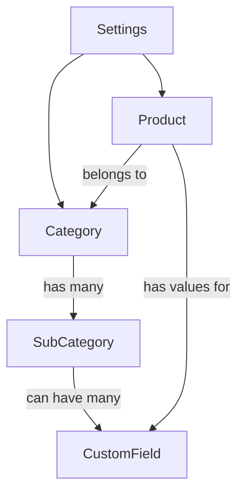

# 
<div align="center">
  
  <h1 style="font-size: 2.5em;">نظام الصدارة لإدارة المنتجات</h1>
  <p><strong>توثيق معماري شامل لإصدار React v1.0</strong></p>
</div>

---

## 1️⃣ نظرة عامة موسعة

### وصف النظام والغرض منه
نظام "الصدارة" هو تطبيق ويب متقدم (Progressive Web App - PWA) لإدارة المنتجات والمخزون، مبني باستخدام React.js. تم تصميمه كحل برمجي متكامل (All-in-One) لتمكين الشركات الصغيرة والمتوسطة من إدارة عملياتها بكفاءة وسلاسة. يعمل النظام كتطبيق أحادي الصفحة (SPA)، مما يوفر تجربة استخدام سريعة ومتجاوبة تشبه تطبيقات سطح المكتب، مع ميزة العمل دون الحاجة للاتصال بالإنترنت.

### أهداف النظام والفئة المستهدفة
- **الهدف الرئيسي**: توفير أداة قوية ومرنة تتكيف مع احتياجات الأعمال المختلفة، بدءًا من إدارة المخزون البسيطة وصولًا إلى تصنيف المنتجات المعقدة باستخدام الحقول المخصصة.
- **الفئة المستهدفة**: 
    - **أصحاب المتاجر**: لإضافة وتتبع منتجاتهم ومعرفة قيمة المخزون.
    - **مديرو المخزون**: لتصنيف المنتجات في فئات هرمية دقيقة ومراقبة الكميات.
    - **البائعون عبر الإنترنت**: لإدارة تفاصيل المنتجات المختلفة التي يعرضونها على منصات متعددة.

### المميزات والوظائف الرئيسية
| الميزة | الوصف التفصيلي | مثال عملي |
|---|---|---|
| **إدارة متكاملة للمنتجات** | نظام كامل لإجراء عمليات (CRUD) على المنتجات، مع دعم الصور، الأكواد (SKU)، والوصف. | يستطيع المستخدم إضافة "لابتوب جديد"، رفع صورته، تحديد سعره وكميته، وكتابة مواصفاته الفنية. |
| **نظام فئات هرمي** | إنشاء هيكل شجري غير محدود العمق من الفئات الرئيسية والفرعية، مما يسمح بتنظيم دقيق للمنتجات. | يمكن إنشاء فئة "ملابس"، وبداخلها "رجالي"، وبداخلها "قمصان"، ثم "قمصان رسمية". |
| **حقول مخصصة ديناميكية** | إمكانية تعريف حقول بيانات فريدة لكل فئة (مثل الحجم، اللون) بـ 8 أنواع مختلفة (نص، رقم، قائمة، إلخ). | لفئة "هواتف ذكية"، يمكن إضافة حقول مخصصة مثل "حجم الشاشة" (رقم) و"نظام التشغيل" (قائمة منسدلة). |
| **واجهة متجاوبة بالكامل** | تصميم يتكيف بسلاسة مع جميع أحجام الشاشات، من الهواتف الذكية إلى شاشات سطح المكتب الكبيرة. | عند فتح التطبيق على الهاتف، يتحول الشريط الجانبي إلى قائمة منبثقة، وتُعرض المنتجات في عمود واحد. |
| **تخصيص كامل للمظهر** | التحكم الكامل في تجربة المستخدم البصرية عبر تغيير السمة (فاتح/داكن) واللون الأساسي للتطبيق. | يمكن للمستخدم اختيار السمة الداكنة واللون الأخضر لتتناسب مع هوية علامته التجارية. |
| **يعمل دون اتصال** | جميع البيانات تُخزن محليًا في المتصفح، مما يضمن استمرارية العمل حتى مع انقطاع الإنترنت. | يمكن للموظف في مستودع لا يوجد به إنترنت إضافة منتجات جديدة، وستتم مزامنتها لاحقًا عند توفر الاتصال. |
| **إدارة آمنة للبيانات** | نظام سهل للنسخ الاحتياطي واستيراد البيانات، مع عمليات حذف آمنة تمنع ترك بيانات يتيمة. | قبل إجراء تغييرات كبيرة، يمكن للمستخدم تصدير نسخة احتياطية كاملة من بياناته كملف JSON. |

### الوضع الحالي والإمكانات المستقبلية
النظام حاليًا هو حل قوي للعمل الفردي دون اتصال بالإنترنت. الرؤية المستقبلية هي تحويله إلى نظام سحابي متكامل يدعم تعدد المستخدمين والعمل الجماعي.

| الجانب | الوضع الحالي | الإمكانات المستقبلية |
|---|---|---|
| **المستخدمون** | مستخدم واحد | نظام أدوار وصلاحيات (مدير، بائع، مشاهد). |
| **البيانات** | تخزين محلي (localStorage / IndexedDB) | مزامنة سحابية فورية مع قاعدة بيانات مركزية (Firebase/Supabase). |
| **التقارير** | إحصائيات بسيطة في لوحة التحكم | تقارير متقدمة وتحليلات للمبيعات والمخزون. |
| **التكامل** | نظام مغلق | ربط مع واجهات برمجية (APIs) خارجية مثل بوابات الدفع ومنصات التجارة الإلكترونية. |

---

## 2️⃣ الهيكل التنظيمي والتصميمي

### هيكل الملفات والمجلدات
```
/src/
├── components/  (مكونات React لواجهة المستخدم)
├── context/     (AppContext: لإدارة الحالة العامة)
├── hooks/       (useLocalStorage: خطاف React مخصص)
├── utils/       (وظائف مساعدة للتنسيق والتحويل)
├── types.ts     (تعريفات TypeScript للبيانات)
├── constants.ts (ثوابت التطبيق)
├── App.tsx      (الهيكل الرئيسي والتنقل بين الصفحات)
└── index.tsx    (نقطة الدخول الرئيسية للتطبيق)
```

### معمارية الواجهة الرئيسية (Master Layout)
يستخدم التطبيق تصميمًا رئيسيًا موحدًا (`App.tsx`) لضمان تجربة متسقة.
- **`Sidebar.tsx`**: شريط جانبي ثابت على الشاشات الكبيرة، يوفر وصولاً سريعًا لجميع الصفحات.
- **`Header.tsx`**: رأس صفحة يظهر فقط على الشاشات الصغيرة، ويحتوي على زر القائمة (Hamburger Menu) لإظهار الشريط الجانبي.
- **منطقة المحتوى**: مساحة ديناميكية يتم فيها عرض الصفحة النشطة حاليًا.

### تصميم متجاوب (Responsive Design)
| حجم الشاشة | الهيكل | تجربة المستخدم |
|---|---|---|
| **الهاتف (Mobile)** | عمود واحد، شريط جانبي منبثق (Off-canvas)، قائمة تنقل سفلية. | مصمم للاستخدام بيد واحدة، مع أزرار كبيرة وسهولة الوصول للوظائف الأساسية. |
| **الجهاز اللوحي (Tablet)** | يبدأ ظهور الأعمدة المتعددة، الشريط الجانبي لا يزال منبثقًا لتوفير المساحة. | استغلال أفضل للمساحة الأفقية لعرض مزيد من المعلومات دون ازدحام. |
| **الحاسوب (Desktop)** | أعمدة متعددة، شريط جانبي ثابت ومرئي دائمًا. | تجربة استخدام كاملة تهدف إلى الإنتاجية، مع عرض جميع عناصر التحكم بشكل واضح. |

---

## 3️⃣ التقنيات والربط

### التقنيات الأساسية
| التقنية | سبب الاستخدام |
|---|---|
| **React.js & TypeScript** | لبناء واجهة مستخدم تفاعلية (SPA) مع ضمان سلامة الأنواع (Type Safety)، مما يقلل الأخطاء ويسهل صيانة الكود. |
| **Tailwind CSS** | إطار عمل Utility-first يسمح ببناء تصميمات مخصصة ومتجاوبة بسرعة فائقة مباشرة في HTML. |
| **Bootstrap 5 (JS)** | للاستفادة من المكونات التفاعلية القوية والمختبرة جيدًا مثل النوافذ المنبثقة (Modals). |
| **Dexie.js (for IndexedDB)** | مكتبة تجعل التعامل مع قاعدة بيانات المتصفح `IndexedDB` سهلاً وممتعًا، وهي مثالية للبيانات المعقدة والهرمية في صفحة الفئات. |
| **SortableJS** | مكتبة خفيفة وقوية لتفعيل وظيفة السحب والإفلات (Drag & Drop) المستخدمة في ترتيب الفئات والحقول. |

### بنية تخزين البيانات والربط المستقبلي
يستخدم النظام حاليًا استراتيجية تخزين محلية مزدوجة:
1.  **`localStorage`**: للبيانات البسيطة مثل المنتجات والإعدادات.
2.  **`IndexedDB`**: للبيانات المعقدة وذات العلاقات مثل الفئات والحقول المخصصة لضمان الأداء العالي.

**خطة الربط مع قاعدة بيانات خارجية (REST API):**
تم تصميم `AppContext.tsx` ليكون طبقة تجريد للبيانات (Data Abstraction Layer). لربط النظام بخادم خارجي، يتم تعديل الوظائف داخل هذا الملف فقط دون الحاجة لتغيير أي مكون واجهة مستخدم.

**مثال: تعديل دالة `addProduct`**
```typescript
// Before: Local Storage only
const addProduct = (productData) => {
  const newProduct = { ... };
  setProducts(prev => [...prev, newProduct]);
};

// After: Connecting to a REST API
const addProduct = async (productData) => {
  try {
    // 1. Send data to server
    const response = await fetch('/api/products', {
      method: 'POST',
      body: JSON.stringify(productData),
      headers: { 'Content-Type': 'application/json' }
    });
    const savedProduct = await response.json();

    // 2. Update local state only after successful server response
    setProducts(prev => [...prev, savedProduct]);
    toast.success('تمت الإضافة والمزامنة بنجاح!');
  } catch (error) {
    toast.error('فشل الاتصال بالخادم. سيتم الحفظ محليًا فقط.');
    // Optional: Add to a queue for later sync
  }
};
```

---

## 4️⃣ وصف الصفحات بالتفصيل

### Dashboard (لوحة التحكم)
- **الوظيفة**: توفر نظرة سريعة وفورية على حالة المخزون.
- **الأقسام**:
    - **بطاقات الإحصائيات**: 4 بطاقات رئيسية تعرض (إجمالي المنتجات، الفئات الرئيسية، قيمة المخزون، والمنتجات منخفضة المخزون). كل بطاقة لها لون وأيقونة مميزة.
    - **نصائح وإرشادات**: قسم ثابت لتوجيه المستخدمين الجدد.
    - **آخر النشاطات**: يعرض آخر 5 منتجات تم تحديثها.
- **التصميم**: تصميم بسيط وواضح يعتمد على البطاقات والمسافات البيضاء.

### Products (صفحة المنتجات)
- **الوظيفة**: المركز الرئيسي لعرض وإدارة جميع المنتجات.
- **الأقسام**:
    - **شريط البحث**: للبحث الفوري بالاسم أو الكود.
    - **شبكة المنتجات**: عرض المنتجات على شكل بطاقات تحتوي على (الصورة، الاسم، الفئة، السعر، والكمية).
    - **نافذة المنتج (ProductModal)**: نافذة منبثقة شاملة لـ(عرض، إضافة، تعديل) المنتج. تتكيف هذه النافذة لعرض الحقول المخصصة تلقائيًا بناءً على الفئة المختارة.
- **منطق العمل**: عند اختيار فئة لمنتج جديد، يقوم النظام بالبحث في شجرة الفئات عن جميع الحقول المخصصة الموروثة وعرضها للمستخدم.

### Categories (صفحة الفئات)
- **الوظيفة**: إدارة الهيكل التنظيمي للمنتجات. هي الصفحة الأكثر تقدمًا في النظام.
- **الأقسام**:
    - **العرض الشجري**: على اليسار، قائمة هرمية بجميع الفئات مع دعم السحب والإفلات لإعادة الترتيب.
    - **لوحة التفاصيل (Inspector Panel)**: على اليمين (في الشاشات الكبيرة)، تعرض تفاصيل الفئة المحددة وحقولها المخصصة.
    - **نافذة إدارة الحقول**: لإضافة وتعديل أنواع الحقول وخياراتها (مثل خيارات القائمة المنسدلة).
- **منطق الحذف الآمن**: عند حذف فئة، يتحقق النظام أولاً من عدم استخدامها في أي منتج. بعد ذلك، يقوم بحذفها وجميع فروعها التابعة لها والحقول المخصصة المرتبطة بها داخل معاملة (Transaction) واحدة لضمان سلامة البيانات.

### Settings (صفحة الإعدادات)
- **الوظيفة**: مركز التحكم في سلوك ومظهر التطبيق وإدارة البيانات.
- **الأقسام**:
    - **إدارة النظام**: روابط سريعة لإدارة الفئات والمنتجات.
    - **المظهر**: للتحكم في السمة (فاتح/داكن) واللون الأساسي.
    - **إعدادات عامة**: لتحديد العملة والتقويم.
    - **إدارة البيانات**: أزرار واضحة لتنفيذ عمليات النسخ الاحتياطي، الاستيراد، وإعادة التعيين.

---

## 5️⃣ المخططات والرسوم التوضيحية

### مخطط تدفق البيانات العام
```mermaid
graph LR
    User[المستخدم] -- يتفاعل مع --> UI{واجهة المستخدم (React)};
    UI -- يرسل إجراء --> Context[AppContext];
    Context -- يعدل --> DB[(التخزين المحلي<br>localStorage / IndexedDB)];
    DB -- يرسل تحديثًا --> State[حالة React];
    State -- تعيد رسم --> UI;
```

### مخطط علاقات البيانات


---

## 6️⃣ التطوير المستقبلي
- **نظام المستخدمين والصلاحيات**: إضافة نظام تسجيل دخول وأدوار مختلفة (مدير، بائع) بصلاحيات محددة.
- **التقارير المتقدمة**: إنشاء لوحة تقارير تفاعلية لتحليل بيانات المخزون والمبيعات.
- **تحسين الأداء للبيانات الضخمة**: استخدام تقنيات العرض الافتراضي (Virtualization) في قوائم المنتجات والفئات التي تحتوي على آلاف العناصر.
- **دعم متعدد اللغات**: إضافة دعم لغات أخرى باستخدام مكتبات مثل `react-i18next`.
```
